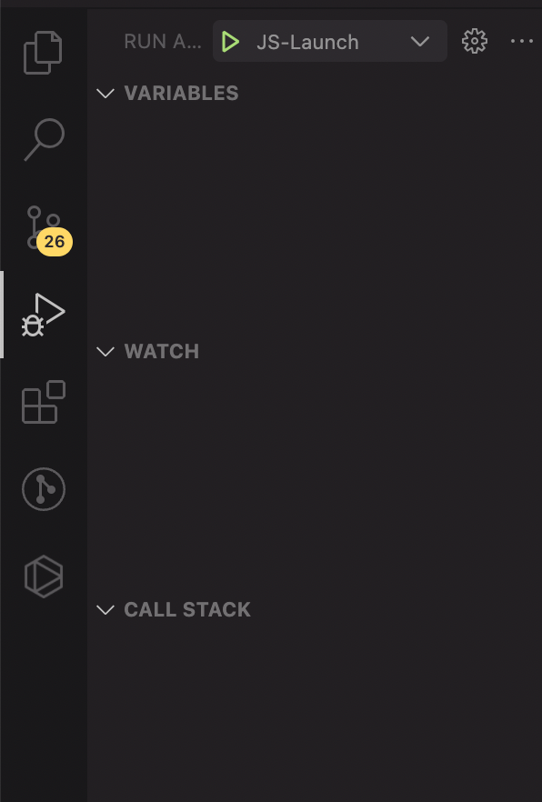
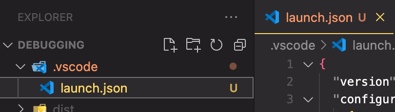
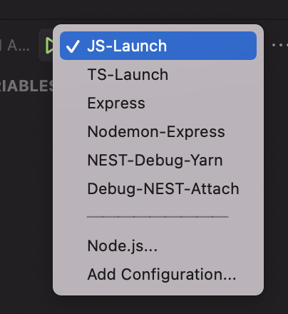
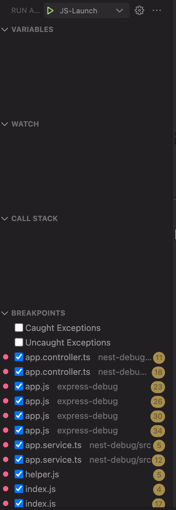
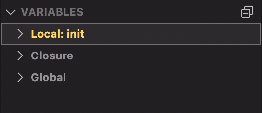
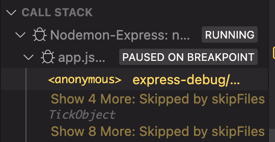
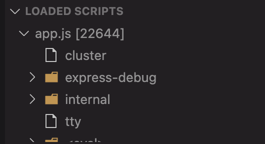
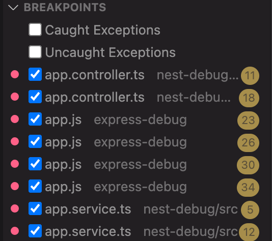

# Debugging all types of Node applications

---

## Steps for debugging

1. Initialize/Debug the applications in this order

- js-debug
- ts-debug
- express-debug
- nest-debug

2. Go to Debugger using `Ctrl + Shift + D` or `⌘ + Shift + D`
   

3. Create launch.json file

   > It will reside in the workspace directory under `.vscode`folder with name`launch.json`

   

4. Put the launch configuration inside the `launch.json` file and in the `debugger` select the configuration
   

5. click on the green play button to attach the debugger

---

## Explanation of each window:

   

### 1. Variables

    - it contains the local, global and closure variable present in the execution context

   

### 2. Watch

    - Watch Window allows you to see value of variables and expressions while debugging.

### 3. Call Stack

    - Shows the function call stack from named to anonymous function

   

### 4. Loaded Scripts

    - Shows the files that are currently in execution

   

### 5. Breakpoints

    - Shows all the breakpoints that you've given in all the files in the workspace

   

---

## Each configuration for `launch.json` for respective file/frameworks

1. Debugging JS Application

```json
    {
      "type": "pwa-node",
      "request": "launch",
      "name": "JS-Launch",
      "skipFiles": ["<node_internals>/**"],
      "program": "${workspaceFolder}/js-debug/index.js",
      "outFiles": ["${workspaceFolder}/**/*.js"]
    },
```

2. Debugging TS Application

```json
    {
      "type": "pwa-node",
      "request": "launch",
      "name": "TS-Launch",
      "skipFiles": ["<node_internals>/**"],
      "program": "${workspaceFolder}/ts-debug/index.ts",
      "preLaunchTask": "tsc: build - ts-debug/tsconfig.json",
      "outFiles": ["${workspaceFolder}/ts-debug/**/*.js"],
      "cwd": "${workspaceFolder}/ts-debug"
    },
```

    you need to have tsc compiler installed: `npm i -g typescript`

3. Debugging Express Application

   **_`debugging this process will require starting of the application and attaching the debugger to a processId`_**

```json
    {
      "name": "Express",
      "processId": "${command:PickProcess}",
      "request": "attach",
      "skipFiles": ["<node_internals>/**"],
      "type": "node"
    },
```

3. Debugging Express-Nodemon Application

```json
    {
      "console": "integratedTerminal",
      "internalConsoleOptions": "neverOpen",
      "name": "Nodemon-Express",
      "program": "${workspaceFolder}/express-debug/app.js",
      "request": "launch",
      "restart": true,
      "runtimeExecutable": "nodemon",
      "skipFiles": ["<node_internals>/**"],
      "type": "node"
    },
```

4. Debugging NESTJS Application using npm/yarn

```json
    {
      "command": "cd nest-debug && yarn run start:dev",
      "name": "NEST-Debug",
      "request": "launch",
      "type": "node-terminal"
    },
```

5. Debugging NESTJS Application using launch

```json
    {
      "type": "pwa-node",
      "request": "launch",
      "name": "Debug-NEST",
      "skipFiles": ["<node_internals>/**", "node_modules/**"],
      "program": "${workspaceFolder}/nest-debug/src/main.ts",
      "runtimeArgs": ["--no-lazy", "-r", "ts-node/register", "-r", "tsconfig-paths/register"],
      "console": "integratedTerminal",
      "sourceMaps": true,
      "cwd": "${workspaceFolder}/nest-debug",
      "internalConsoleOptions": "openOnSessionStart"
    },
```
